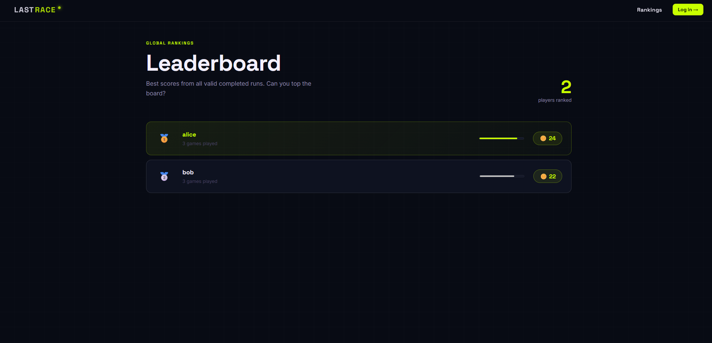
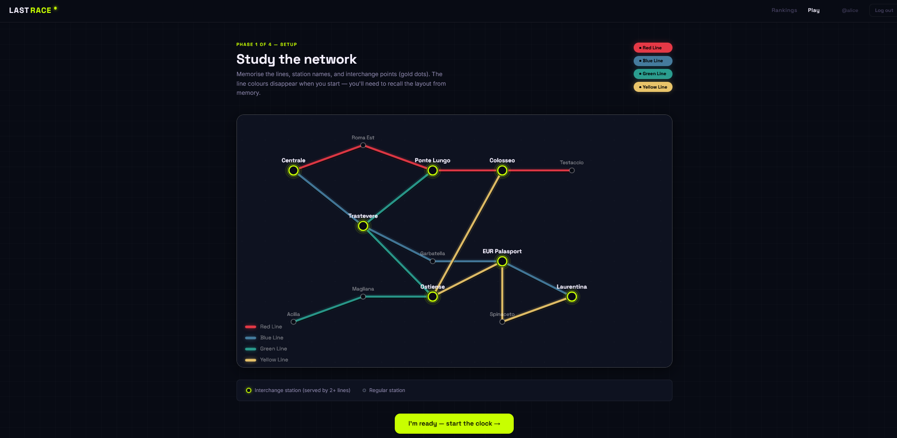

# Exam #1: "Last Race"

**Student:** s352044 Rai Aayush

---

## React Client Application Routes

| Route | Purpose |
|---|---|
| `/` | Home page — shows game instructions and rules. Anonymous users see instructions only (no map). Logged-in users see a "Start playing" call to action. |
| `/login` | Login page — two-panel layout with branding and login form. On success redirects to `/game`. |
| `/game` | Protected game page — runs through all 4 phases: Setup → Planning → Execution → Result. Redirects to `/login` if not authenticated. |
| `/leaderboard` | Public leaderboard — shows every user's best score and total games played. No login required. |

---

## API Server

### Authentication — `/api/session`

| Method | Endpoint | Auth | Description |
|---|---|---|---|
| `POST` | `/api/session` | No | **Login.** Body: `{ username, password }`. Returns `{ id, username }` on success, `401` on wrong credentials. |
| `DELETE` | `/api/session` | Yes | **Logout.** Destroys the current session. Returns `204 No Content`. |
| `GET` | `/api/session/current` | No | **Get current user.** Returns `{ id, username }` if a valid session exists, `401` otherwise. |

### Network — `/api/network`

| Method | Endpoint | Auth | Description |
|---|---|---|---|
| `GET` | `/api/network` | Yes | **Full metro network.** Returns `{ lines, stations, segments }`. Protected — anonymous users cannot access the map per spec. |

### Game — `/api/game`

| Method | Endpoint | Auth | Description |
|---|---|---|---|
| `POST` | `/api/game/start` | Yes | **Start a game.** Randomly selects a start and destination station guaranteed to be at least 3 segments apart (BFS). Returns `{ gameContext: { startStation, endStation }, network }`. The `planningSegments` field strips line colour/name so the client cannot cheat during planning. |
| `POST` | `/api/game/execute` | Yes | **Execute a route.** Body: `{ route: number[], startId: number, endId: number }`. Validates the submitted route, applies a random event to each segment, saves the score to the database. Returns `{ valid, reason, steps, finalScore }`. |
| `GET` | `/api/game/leaderboard` | No | **Leaderboard.** Returns `[{ username, best_score, games_played }]` ordered by best score descending. Public. |

---

## Database Tables

| Table | Purpose |
|---|---|
| `lines` | The 4 metro lines — each has an `id`, `name`, and `color` (hex string used by the SVG map). |
| `stations` | All 13 stations in the network — `id` and `name`. |
| `line_stations` | Join table mapping stations to lines with an ordered `position` column. Consecutive positions define which stations are adjacent (i.e. form a segment). |
| `events` | 10 random events that fire during execution — each has a `description` and an integer `effect` between −4 and +4. |
| `users` | Registered users — `id`, `username`, `password_hash` and `salt` (scrypt). Passwords are never stored in plain text. |
| `games` | One row per completed game — stores `user_id`, `start_station`, `end_station`, `score`, `route_valid` (0/1), and `created_at`. Used for the leaderboard. |

---

## Main React Components

| Component | File | Purpose |
|---|---|---|
| `App` | `src/App.jsx` | Root — sets up `BrowserRouter`, `AuthProvider`, all routes, and `ProtectedRoute` guard. |
| `AuthProvider` / `useAuth` | `src/context/AuthContext.jsx` | React context that holds the logged-in user, exposes `login` and `logout`, and checks the session cookie on mount via `GET /api/session/current`. |
| `Navbar` | `src/components/Navbar.jsx` | Sticky top navigation bar — shows logo, Rankings and Play links, username, and logout button. Active route highlighted. |
| `NetworkMap` | `src/components/NetworkMap.jsx` | SVG metro map rendered from network data. Accepts a `showLines` boolean — `true` shows full colour lines (Setup phase), `false` shows only station dots and names (Planning phase). Interchange stations shown with a gold accent ring. |
| `useCountdown` | `src/hooks/useCountdown.js` | Custom hook for the 90-second planning timer. Returns `timeLeft`, formatted `MM:SS` string, `isExpired` flag, and percentage. Calls an `onExpire` callback and cleans up its own interval on unmount. |
| `GamePage` | `src/pages/GamePage.jsx` | Orchestrates the 4 game phases as a state machine (`setup → planning → execution → result`). Owns all API calls and passes data down as props to phase components. |
| `SetupPhase` | `src/pages/game/SetupPhase.jsx` | Phase 1 — displays the full colour network map with line legend. Player studies the map then clicks ready. |
| `PlanningPhase` | `src/pages/game/PlanningPhase.jsx` | Phase 2 — shows mission banner (start → destination), colourless map, 90s countdown timer, and clickable segment list. Only segments connected to the last selected station are highlighted. Each segment can be selected only once. Undo removes the last step. |
| `ExecutionPhase` | `src/pages/game/ExecutionPhase.jsx` | Phase 3 — reveals the journey step by step. Each step shows the segment travelled, the random event that fired, the coin effect, and the updated balance. Invalid routes show a penalty screen immediately. |
| `ResultPhase` | `src/pages/game/ResultPhase.jsx` | Phase 4 — displays the final score with contextual message, segments completed, validity status, play again button, and link to leaderboard. |
| `HomePage` | `src/pages/HomePage.jsx` | Landing page — hero section, decorative metro diagram, stats strip (4 lines, 13 stations, 90s), and how-to-play cards. Anonymous users see a login CTA. |
| `LoginPage` | `src/pages/LoginPage.jsx` | Two-panel login — branding/line colours on the left, form on the right with demo account hints. |
| `LeaderboardPage` | `src/pages/LeaderboardPage.jsx` | Public rankings — card rows with medal icons, score bars, and coin badges ordered by best score. |

---

## Screenshots

> **Leaderboard page**
> 

> **In-game — Planning phase**
> 

---

## User Credentials

| Username | Password | Notes |
|---|---|---|
| `alice` | `alice123` | 3 completed games |
| `bob` | `bob456` | 2 completed games |
| `carol` | `carol789` | No games yet |

---

## Use of AI Tools

Claude (Anthropic) was used during development to help scaffold the initial project structure, suggest the layered architecture pattern (DAOs / routes / context), and generate boilerplate code. All generated code was carefully reviewed, understood, and adapted — including the BFS algorithm for start/destination assignment, the route validation logic (line change rules at interchange stations), the Passport.js authentication flow, and the React game state machine. The database schema, network design, event descriptions, and UI layout decisions were all verified and adjusted manually. No code was committed without full understanding of its purpose and behaviour.
